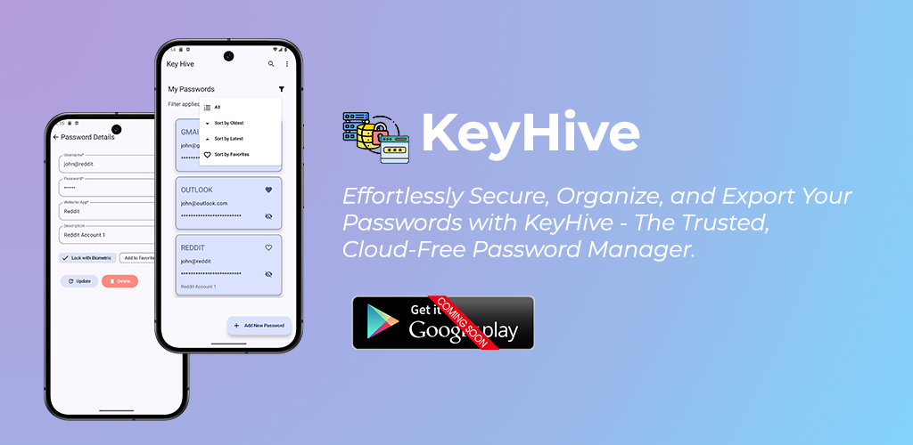

# KeyHive

KeyHive is a cloud-free password manager designed to help you securely store, manage, and organize your passwords locally on your device. With a focus on privacy and an intuitive user experience, KeyHive ensures your sensitive information remains offline and safe.

---

## Key Features

- **Add & Customize Passwords**  
  Store usernames, passwords, and descriptions with ease.

- **Biometric Security**  
  Enable biometric authentication for enhanced local protection.

- **Favorites & Sorting**  
  Mark important passwords as favorites and sort them for quick access.

- **Export as CSV**  
  Backup your password data by exporting it into a CSV file for local storage.

- **Offline First**  
  100% local storage, ensuring complete data privacy with no internet dependency.

- **Elegant UI**  
  Enjoy a clean, user-friendly design for smooth navigation.

## V1.0 Release Notes

We’re excited to introduce **KeyHive v1.0**, your trusted cloud-free password manager! With KeyHive, securely store, manage, and access your passwords locally without relying on cloud services.

### What's New in V1.0:
- **Add & Customize** passwords easily.
- **Biometric Security** for added protection.
- **Favorites & Sorting** for efficient management.
- **Export as CSV** for backup.
- **Elegant UI** for smooth navigation.
- **Offline First** with 100% local storage.

Thank you for choosing KeyHive! Stay tuned for future updates!

## Download

**Available Soon on Google Play Store**

---

## Feedback

We would love to hear your feedback! If you encounter any issues or have suggestions, feel free to [open an issue](https://github.com/ShyamSundhar1411/Key-Hive-Kotlin/issues) or reach out with ideas.

---

Thank you for using KeyHive! Stay tuned for future updates.
